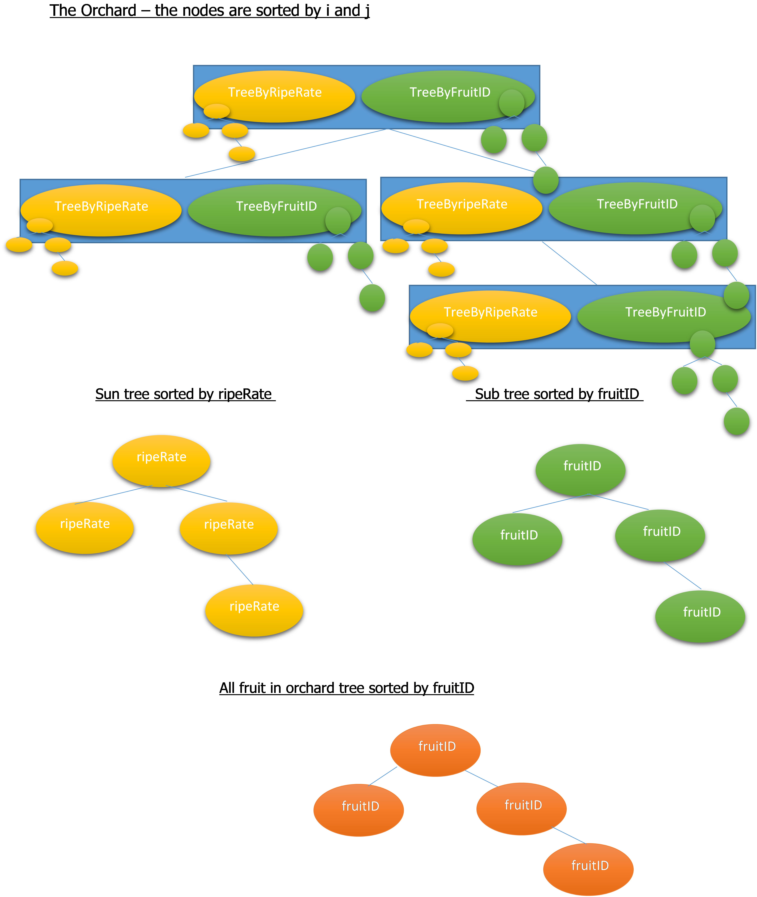

# AVL_tree
assignment - data structures - AVL trees
This is an implementation of Orchard system using AVL trees data strucrures.
The data structures implementation -

The implemented functions -
  void*  Init(intN) - initialize an empty orchard  (time compleixty O(1))
  StatusTypePlantTree(void *DS,int i, int j) - planet a new tree in hole(i,j) - (time compleixty o(log(n)))
  StatusTypeAddFruit(void *DS,int i, intj, intfruitID, int ripeRate) add fruit to the tree in hole(i,j)  (time compleixty o(log(n)+log(k)))
  StatusTypePickFruit(void *DS,intfruitID) -  (time compleixty o(log(n)+log(k)))
  StatusTypeRateFruit(void *DS,intfruitID, intripeRate) - update the fruit riperate (time compleixty o(log(n)+log(k)))
  StatusType GetBestFruit(void *DS, int i, int j, int*fruitID) -  get the fruit with the smallest ripeRate (time compleixty o(log(n)))
  StatusType GetAllFruitsByRate(void *DS,int i, int j, int **fruits, int *numOfFruits) - returns all the fruit in a trre in the hole(i,j) sorted by riperate 
  
